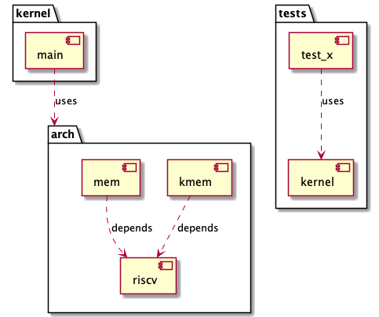
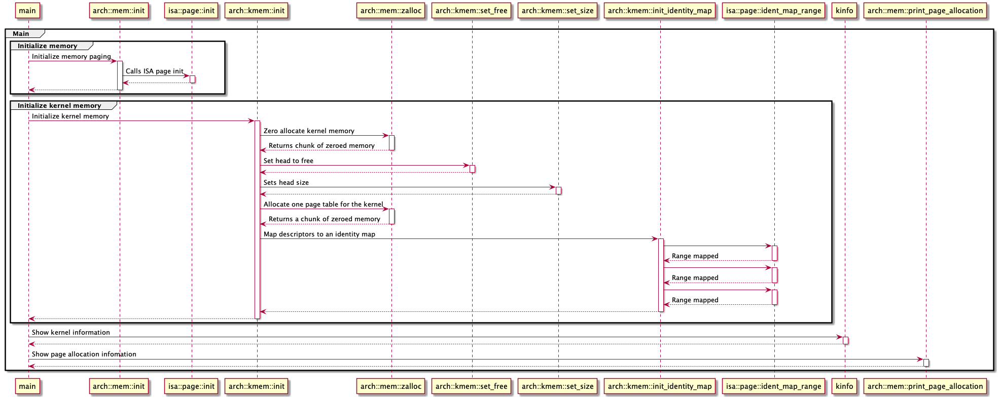
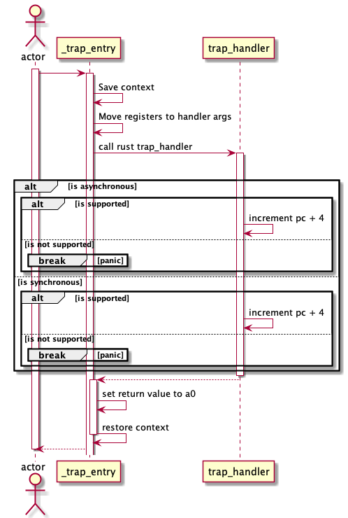
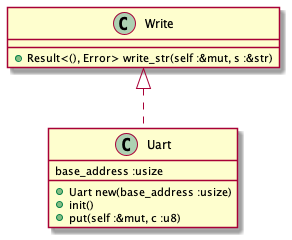
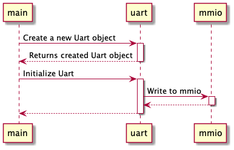

- [About The Project](#about-the-project)
  - [Built With](#built-with)
- [Getting Started](#getting-started)
  - [Prerequisites](#prerequisites)
  - [Running](#running)
  - [Running the tests](#running-the-tests)
- [Roadmap](#roadmap)
- [Diagrams](#diagrams)
  - [Components overview](#components-overview)
  - [Kernel and architecture sequence diagram](#kernel-and-architecture-sequence-diagram)
  - [Traps](#traps)
    - [RISC-V](#risc-v)
  - [Uart diagram](#uart-diagram)
    - [Class diagram](#class-diagram)
    - [Sequence diagram](#sequence-diagram)
- [Contributing](#contributing)
- [License](#license)
- [Contact](#contact)

## About The Project

A microkernel(?) who aims at developing a secure, efficient and fault tolerant
system, allowing support for multiple architecture. Currently, it only supports
RISC-V.

### Built With

- Rust
- RISC-V
- Qemu

## Getting Started

### Prerequisites

1. `rustc 1.53.0-nightly`
2. `cargo 1.53.0-nightly`
3. Qemu with RISC-V
   [support](https://wiki.qemu.org/Documentation/Platforms/RISCV)

### Running

At the moment, this kernel runs in Qemu. For running the kernel, run `cargo run`

### Running the tests

1. Run `cargo test`

## Roadmap

See the [implementation](https://github.com/benmezger/strail-rs/projects/1)
roadmap and [open issues](https://github.com/benmezger/strail-rc/issues) for a
any reported or known issues.

## Diagrams

### Components overview

### Kernel and architecture sequence diagram

### Traps

#### RISC-V

### Uart diagram

#### Class diagram

#### Sequence diagram

## Contributing

See [CONTRIBUTING](./CONTRIBUTING.md).

## License

Distributed under the MIT License. See `LICENSE` for more information.

## Contact

Ben Mezger - [@benmezger](https://github.com/benmezger) - <me@benmezger.nl>

Project Link:
[https://github.com/benmezger/strail-rs](https://github.com/benmezger/strail-rs)
